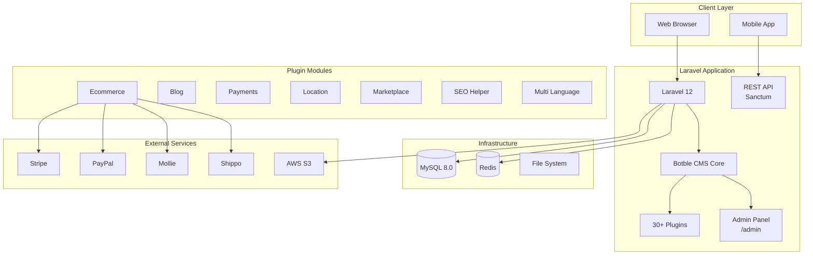

<div align="center">
  <h1>🛒 AcdowzCo</h1>
  <p><strong>Enterprise E-Commerce Platform — Multi-vendor grocery & foods marketplace built on Botble CMS with Laravel 12.</strong></p>

  <p>
    <a href="LICENSE">
      
    </a>
    <a href="https://github.com/SohaibKhaliq/AcdowzCo/stargazers">
      
    </a>
    <a href="https://github.com/SohaibKhaliq/AcdowzCo/forks">
      
    </a>
    <a href="https://github.com/SohaibKhaliq/AcdowzCo/issues">
      
    </a>
    
    
    
    
    
    
  </p>

  <h3>
    <a href="#-overview">Overview</a> •
    <a href="#-features">Features</a> •
    <a href="#-tech-stack">Tech Stack</a> •
    <a href="#-quick-start">Quick Start</a> •
    <a href="#-architecture">Architecture</a> •
    <a href="#-payment-gateways">Payments</a> •
    <a href="#-contributing">Contributing</a>
  </h3>
</div>

---

## 📋 Table of Contents

- [Overview](#-overview)
- [Features](#-features)
- [Tech Stack](#-tech-stack)
- [Quick Start](#-quick-start)
  - [Prerequisites](#prerequisites)
  - [Standard Setup](#standard-setup)
  - [Docker Setup (Sail)](#docker-setup-sail)
- [Environment Variables](#-environment-variables)
- [Architecture](#-architecture)
- [Payment Gateways](#-payment-gateways)
- [Modules](#-modules)
- [Project Structure](#-project-structure)
- [Security](#-security)
- [Roadmap](#-roadmap)
- [Contributing](#-contributing)
- [License](#-license)
- [FAQ](#-faq)

---

## 📖 Overview

**AcdowzCo** is a full-featured e-commerce platform built on **Botble CMS** with **Laravel 12**. Designed as an online grocery and foods marketplace (branded as "Farmart"), it provides a complete multi-vendor shopping experience with powerful admin management, multiple payment gateways, and SEO-optimized storefronts.

### Why AcdowzCo?

| Challenge | Solution |
|-----------|----------|
| Need a full e-commerce CMS | Botble CMS provides modular architecture with 30+ plugins |
| Multi-payment support | 8+ payment gateways (Stripe, PayPal, Mollie, Razorpay, Paystack, SSLCommerz, etc.) |
| SEO requirements | Built-in SEO helper, sitemap, slug, and social graph support |
| Multi-language | Complete i18n with language switcher and RTL support |
| Marketplace needs | Vendor management, commission tracking, and shipping integration |

---

## ✨ Features

| Feature | Description | Status |
|---------|-------------|--------|
| 🛍️ **E-Commerce Engine** | Products, categories, brands, variants, cart, checkout, orders | ✅ Stable |
| 💳 **8+ Payment Gateways** | Stripe, PayPal, Mollie, Razorpay, Paystack, SSLCommerz, and more | ✅ Stable |
| 🔍 **SEO Optimized** | Meta tags, Open Graph, sitemap, slug management, canonical URLs | ✅ Stable |
| 🌐 **Multi-Language** | Full i18n with language switcher, translations, RTL support | ✅ Stable |
| 📝 **Blog Engine** | Posts, categories, tags, author management, RSS feeds | ✅ Stable |
| 📍 **Location Management** | States, cities, shipping zones, warehouse management | ✅ Stable |
| 👥 **Customer Accounts** | Registration, login, social login (Google, Facebook), profiles | ✅ Stable |
| 🏪 **Multi-Vendor** | Vendor registration, product management, commission tracking | ✅ Stable |
| 📦 **Shipping** | Shipstation/Shippo integration, shipping rules, zones | ✅ Stable |
| 📊 **Analytics** | Sales reports, visitor analytics, conversion tracking | ✅ Stable |
| 📋 **Contact & Forms** | Contact forms, inquiry management, FAQ system | ✅ Stable |
| 📧 **Newsletter** | Email subscription, campaign management, Mailchimp integration | ✅ Stable |
| 🔐 **RBAC** | Admin roles, permissions, user management with ACL | ✅ Stable |
| 🧩 **Modular Plugin System** | 30+ plugins, extensible architecture via composer merge | ✅ Stable |
| 🐳 **Docker Support** | Laravel Sail with MySQL 8.0, ready-to-deploy | ✅ Stable |

---

## 🛠 Tech Stack

| Category | Technology | Purpose |
|----------|-----------|---------|
| **Framework** | Laravel 12.x | PHP web framework |
| **CMS** | Botble Platform (dev) | Modular CMS core |
| **Language** | PHP 8.3 | Runtime |
| **Database** | MySQL 8.0 | Relational store |
| **Cache/Session** | Redis (via Predis) | In-memory caching |
| **Frontend** | Vue 3 + Bootstrap 5 | Reactive UI components |
| **Build Tool** | Laravel Mix / Webpack | Asset compilation |
| **Auth** | Laravel Sanctum | API token auth |
| **HTTP Client** | Guzzle 7 | API integrations |
| **Migrations** | Doctrine DBAL 4 | Schema management |

---

## 🚀 Quick Start

### Prerequisites

- PHP 8.3+, Composer 2.x, MySQL 8.0, Node.js 20+
- Or Docker (for Sail)

### Standard Setup

```bash
# Clone
git clone https://github.com/SohaibKhaliq/AcdowzCo.git
cd AcdowzCo

# Install PHP dependencies
composer install

# Configure environment
cp .env.example .env
php artisan key:generate
# Edit .env: DB_DATABASE, DB_USERNAME, DB_PASSWORD, APP_URL

# Create database and import schema
mysql -u root -p -e "CREATE DATABASE acdowzco"
mysql -u root -p acdowzco < database.sql

# Install & build frontend
npm install
npm run production

# Serve
php artisan serve
```

### Docker Setup (Sail)

```bash
# Start environment
./vendor/bin/sail up -d

# Inside container
./vendor/bin/sail artisan key:generate
./vendor/bin/sail artisan migrate

# Access at http://localhost
```

---

## 🔧 Environment Variables

| Variable | Required | Description | Default |
|----------|----------|-------------|---------|
| `APP_URL` | ✅ | Base URL of the application | `http://localhost` |
| `APP_ENV` | ✅ | Environment mode | `production` |
| `APP_DEBUG` | ✅ | Debug mode (disable in production) | `false` |
| `APP_KEY` | ✅ | Application encryption key | — |
| `DB_DATABASE` | ✅ | MySQL database name | `laravel` |
| `DB_USERNAME` | ✅ | MySQL username | `root` |
| `DB_PASSWORD` | ⚠️ | MySQL password | — |
| `ADMIN_DIR` | ✅ | Admin panel URL segment | `admin` |
| `CMS_ENABLE_INSTALLER` | ⚠️ | Enable web installer | `true` |
| `SESSION_HTTP_ONLY` | ✅ | Prevent JS cookie access | `true` |
| `SESSION_SECURE_COOKIE` | ⚠️ | HTTPS-only cookies | `false` |
| `ENABLE_HTTP_SECURITY_HEADERS` | ✅ | Security headers (CSP, XSS, etc.) | `true` |
| `REDIS_HOST` | ⚠️ | Redis server host | `127.0.0.1` |
| `CACHE_STORE` | ⚠️ | Cache driver | `file` |

---

## 🏗 Architecture



---

## 💳 Payment Gateways

| Gateway | Type | Status |
|---------|------|--------|
| **Stripe** | Credit Card, Wallet | ✅ Integrated |
| **Stripe Connect** | Marketplace payouts | ✅ Integrated |
| **PayPal** | Express Checkout | ✅ Integrated |
| **PayPal Payout** | Mass payments | ✅ Integrated |
| **Mollie** | European payments | ✅ Integrated |
| **Razorpay** | Indian payments | ✅ Integrated |
| **Paystack** | African payments | ✅ Integrated |
| **SSLCommerz** | Bangladesh payments | ✅ Integrated |

---

## 🧩 Modules (30+ Plugins)

| Module | Description |
|--------|-------------|
| **Ecommerce** | Products, categories, brands, orders, customers, cart, checkout, shipping |
| **Blog** | Posts, categories, tags, RSS, author management |
| **Marketplace** | Multi-vendor store management, commissions |
| **Payment** | Multi-gateway payment processing |
| **Stripe Connect** | Marketplace payment splitting |
| **Location** | Countries, states, cities, shipping zones |
| **Language** | Multi-language, translations, RTL |
| **SEO Helper** | Meta tags, OG, JSON-LD, sitemap |
| **Analytics** | Visitor stats, page views |
| **Social Login** | Google, Facebook OAuth |
| **Newsletter** | Email subscriptions, Mailchimp |
| **FAQ** | Frequently asked questions management |
| **Contact** | Contact form, inquiries |
| **Cookie Consent** | GDPR cookie consent banner |
| **Captcha** | reCAPTCHA integration |
| **Audit Log** | User activity tracking |
| **Backup** | Automated database + file backups |
| **Sitemap** | XML sitemap generation |
| **Slug** | URL slug management |
| **Shortcode** | Content shortcode parser |
| **Widget** | Sidebar widget management |

---

## 📂 Project Structure

```
AcdowzCo/
├── app/                      # Laravel application code
│   ├── Http/Controllers/    # Base controllers
│   └── Models/              # User model
├── platform/                 # Botble CMS core + modules
│   ├── core/                # Platform core framework
│   ├── packages/            # Shared packages
│   ├── plugins/             # 30+ feature plugins
│   │   ├── ecommerce/       # Full e-commerce engine
│   │   ├── blog/            # Blog system
│   │   ├── marketplace/     # Multi-vendor support
│   │   ├── payment/         # Payment processing
│   │   ├── stripe/          # Stripe integration
│   │   ├── paypal/          # PayPal integration
│   │   ├── mollie/          # Mollie integration
│   │   ├── razorpay/        # Razorpay integration
│   │   └── ... (30+ total)
│   └── themes/
│       └── farmart/         # Farmart grocery theme
├── config/                   # Laravel configuration
├── database/                 # Migrations and seeders
├── public/                   # Web root (index.php)
├── resources/                # Views (Blade), assets, lang
├── routes/                   # Web + API routes
├── storage/                  # Logs, cache, uploads
├── tests/                    # PHPUnit tests
├── docker-compose.yml        # Laravel Sail
├── database.sql              # Full database dump
├── composer.json
└── .env.example
```

---

## 🔒 Security

### Best Practices

- **Session security**: HTTP-only cookies enabled by default, HTTPS-only configurable
- **Security headers**: X-Content-Type-Options, X-Frame-Options, X-XSS-Protection, Referrer-Policy
- **Admin URL**: Configurable via `ADMIN_DIR` environment variable (change from default `admin`)
- **Installer**: Disable `CMS_ENABLE_INSTALLER` in production
- **APP_DEBUG**: Always set to `false` in production
- **CSP**: Content Security Policy headers configurable

### Reporting Vulnerabilities

Report vulnerabilities privately to the repository maintainer. See [SECURITY.md](SECURITY.md).

---

## 🗺 Roadmap

### Phase 1 — Foundation ✅
- [x] Botble CMS core integration
- [x] E-commerce engine (products, cart, checkout, orders)
- [x] Blog, FAQ, Contact modules
- [x] Multi-language support
- [x] SEO optimization suite
- [x] Admin panel with RBAC

### Phase 2 — Payments & Shipping 🔄
- [x] 8+ payment gateway integrations
- [x] ShipStation/Shippo shipping
- [x] Marketplace vendor system
- [ ] Automated deployment CI/CD

### Phase 3 — Scale 📈
- [ ] Mobile app API expansion
- [ ] Advanced analytics dashboard
- [ ] Inventory management automation
- [ ] AI-powered product recommendations
- [ ] Progressive Web App (PWA)

---

## 🤝 Contributing

Contributions welcome! Please read [CONTRIBUTING.md](CONTRIBUTING.md) and [CODE_OF_CONDUCT.md](CODE_OF_CONDUCT.md).

---

## 📄 License

MIT License (as specified in `composer.json`).

---

## ❓ FAQ

<details>
<summary><strong>What is Botble CMS?</strong></summary>
Botble CMS is a modular Laravel-based content management system. AcdowzCo uses it as the foundation platform, adding plugins for e-commerce, payments, multi-language, and more.
</details>

<details>
<summary><strong>How do I change the admin URL?</strong></summary>
Set the <code>ADMIN_DIR</code> environment variable in your .env file. Example: <code>ADMIN_DIR=myadmin</code> makes the admin panel available at <code>/myadmin</code>.
</details>

<details>
<summary><strong>How do I add a new payment gateway?</strong></summary>
Install the corresponding Botble plugin in <code>platform/plugins/</code> and configure the API keys in the admin panel under Settings → Payments.
</details>

---

<div align="center">
  <sub>Built with ❤️ by <a href="https://github.com/SohaibKhaliq">Sohaib Khaliq</a></sub>
  <br/>
  <sub>⭐ Star this repo if you find it useful! ⭐</sub>
</div>
